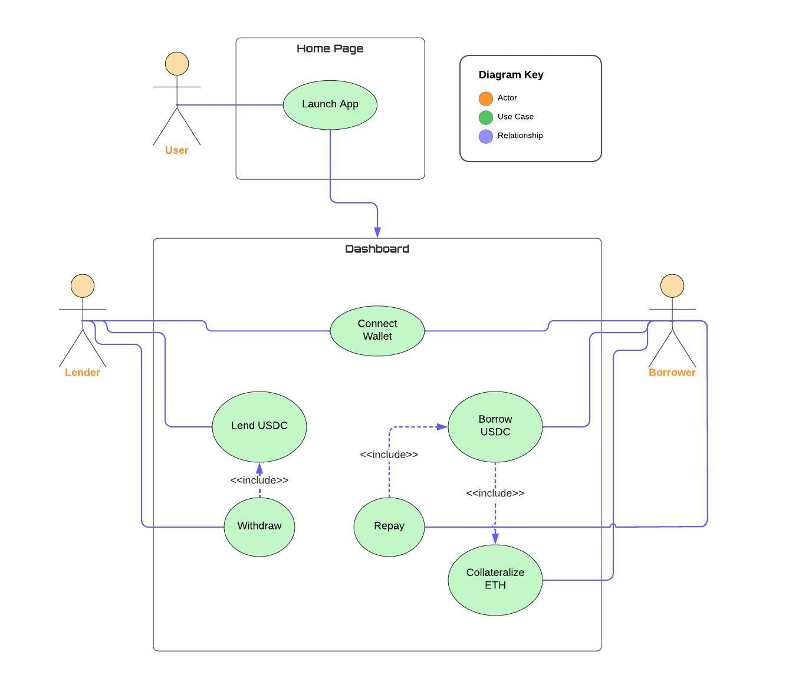

# Fusion Finance 

### Author: [John Nguyen](https://github.com/jooohneth)

## Info

- [Web-app](https://fusion-finance.vercel.app/)
- [Fusion token address on Goerli](https://goerli.etherscan.io/token/0x61210d5491a8E6e2B9EAF93075364d6301Ba72ED)
- [Fusion core address on Goerli](https://goerli.etherscan.io/address/0xD725F3aD2355CfC57ac0F33fE0378442c4dA17eE)
- [DAI address on Goerli](https://goerli.etherscan.io/token/0x11fE4B6AE13d2a6055C8D9cF65c55bac32B5d844)

## Overview

A decentralized lending and borrowing protocol for users to lend and borrow Base Asset. A completely trustless environment for both lenders and borrowers, built on top of Ethereum and Ethereum L2 solutions. Lenders supply the protocol with Base Asset and in return earn interest in a form of $FUSN tokens, protocol’s governance token. Thanks to lenders, our protocol will have liquidity to supply the borrowers with Base Asset. In order for borrowers to borrow they will have to collateralize ETH, our protocol works in an over-collateralized model, meaning borrower’s ETH collateral amount > Base Asset amount they can borrow. The borrowers pay interest to the protocol in order to maintain it, the interest will be deducted from ETH collateral when the borrower borrows Base Asset. In case of liquidation, our protocol keeps the borrower's ETH collateral and rewards the liquidator.

## Deliverables

### Web App:

- Collateralize ETH
- Withdraw Base Asset
- Repay Base Asset
- Explore the following information:
  - Protocol’s name
  - User’s wallet address.
  - User’s ETH and $FUSN balance.
  - Base Asset % APY
  - Current supplied or borrowed amounts, if any.

### Smart-contracts:

- FusionCore contract:

  - Mapping of lender to amount of Base Asset provided.
  - Mapping of lender to amount of $FUSN earned.
  - Mapping of borrower to amount of Base Asset borrowed.
  - Mapping of borrower to amount of ETH collateralized.
  - Lend function - saves earned $FUSN amount, if any => updates lend position state => sends user’s provided amount of Base Asset to the protocol.
  - Lender’s withdrawal function - saves amount of $FUSN earned, if any => resets lend position state => sends ETH to protocol.
  - Claim Yield function - calculates earned $FUSN yield => mints the lender the amount.
  - Collateralize ETH function - updates collateral position => sends ETH to protocol.
  - Withdraw ETH function(Can’t be called while borrowing) - updates collateral position => sends ETH to user.
  - Borrow function(Only if ETH is collateralized) - deduct protocol’s fees (0.3%) => updates borrow position => sends the user amount of Base Asset provided inside the borrow limit.
  - Borrower’s repay function - updates borrow position state => sends Base Asset from borrower to protocol.
  - Liquidate function(any user including the deployer can execute a liquidation function) - check if the liquidation point has been passed => liquidate borrower’s position => send the liquidator liquidation reward (1.25%) of borrower’s ETH collateral as reward.
  - Calculate Price of ETH function - Using Chainlink’s price oracle calculates and returns the price of ETH in Base Asset.
  - Calculate Yield Time - calculates the amount of time the lender has been lending.
  - Calculate Yield Total - calculates the amount of $FUSN tokens the lender has earned.
  - Calculate Borrow limit function - get the price of ETH in
  - Base Asset => (ETH price _ ETH collateral) _ borrow rate (70%) - borrower’s amount of borrowed Base Asset, if any .
  - Calculate Liquidation point - get the price of ETH in Base Asset => amount of borrowed Base Asset + liquidation rate (10%).

- FusionToken ($FUSN) contract:

  - Type - ERC20 token
  - Max supply - 21 million $FUSN Tokens.
  - Purpose - Mints tokens to lenders as reward.

## UML Use Case Diagram

